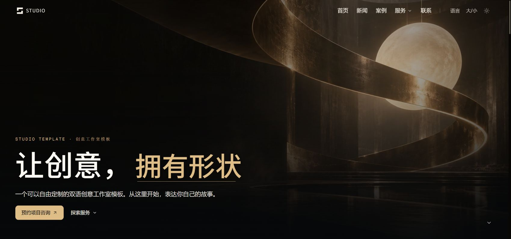

# Cinematic Studio Template

A bilingual creative studio website with cinematic layouts, a dark gold / light blue theme system, responsive navigation and a built-in content dashboard.

双语创意工作室网站模板，包含电影感首页、服务详情、案例与新闻页面，以及本地内容管理后台。默认内容为通用示例，案例、新闻、合作品牌和背景视频为空，可替换为自己的内容。



## Features

- Chinese / English interface and persistent theme preferences.
- Responsive navigation, animated sections, keyboard controls and reduced-motion support.
- Editable services, case studies, partner logos, hero videos and contact settings.
- Media library with uploads, folders and controlled file operations.
- Optional contact submissions, SMTP notifications and external course catalog.
- SEO metadata, sitemap, robots and deployment under a configurable base path.

Stack: Next.js 15, React 19, TypeScript, Tailwind CSS, Framer Motion, Lenis and Lucide.

## Quick start

Use Node.js 22 LTS and npm.

```sh
npm ci
cp .env.example .env.local
npm run dev
```

On Windows PowerShell, use `Copy-Item .env.example .env.local` instead of `cp`.
Open `http://localhost:3000`. The dashboard starts at `/admin/cases`.

Set **both** `CASE_ADMIN_PASSWORD` and `CASE_ADMIN_SECRET` in `.env.local` to enable dashboard login. Choose your own strong password and random secret. There is no shared default password, and dashboard authentication stays disabled when either value is missing.

```sh
npm run lint
npm test
npm run build
npm run start
```

## Customize

| Content | Location |
| --- | --- |
| Services and partner logos | `data/home-content.json` or `/admin/services`, `/admin/brands` |
| Case studies | `data/cases.json` or `/admin/cases` |
| Hero videos | `data/hero-videos.json` or `/admin/videos` |
| Contact details | `data/site-settings.json` or `/admin/contact` |
| Public media uploads | `/admin/files`; stored in `public/uploads/` |
| Interface copy and team example | `lib/i18n.ts`, `lib/director-team.ts` |
| News articles | `lib/news.ts`, `lib/news-imported.json`; match article IDs in both files |
| Logo, colors and fonts | `components/brand/BrandLogo.tsx`, `app/globals.css`, `tailwind.config.ts`, `app/layout.tsx` |

The bundled hero and service artwork were generated with the built-in image_gen tool for this template and optimized as WebP. They are generic sample artwork, not real client work. The generation prompts are recorded in [docs/image-prompts.json](docs/image-prompts.json). Team profiles are explicitly labeled examples. Add your own authorized media and replace sample text before launching a real business site. The workshop service demonstrates a course layout; it has no bundled courses, activities or project videos.

## Optional integrations

Contact collection is **off by default**. To enable it, set `CONTACT_FORM_ENABLED=true`. Submissions are stored in `data/leads.json`, which is ignored by Git. Configure recipients in the dashboard and SMTP settings in the environment if email notifications are needed. With no recipient or SMTP configuration, no notification is sent.

Courses are **off by default**. Set `COURSES_API_ORIGIN` to your course service and optionally `NEXT_PUBLIC_COURSE_LOGIN_URL` to its login page. No external company service is called by default.

## Deployment

Use a server or container with persistent writable storage. This implementation uses local JSON and files, so it is intended for a single application instance. Multiple instances or serverless hosting require replacing the file stores with a database and object storage.

Set `SITE_ORIGIN` to your own public origin. For a subdirectory, set `BASE_PATH` **before building**; rebuild after changing it. Google title fonts are downloaded by Next.js at build time, so the build environment needs access to Google Fonts. Body fonts are bundled locally.

Docker Compose:

```sh
cp .env.example .env
# Configure your origin and both admin values in .env.
mkdir -p public/uploads
docker compose up -d --build
```

On Windows, create the folder with `New-Item -ItemType Directory -Force public/uploads`. The default port is `8060`. Make `data` and `public/uploads` writable by container UID/GID `1001` on Linux. Terminate HTTPS at your reverse proxy. Back up these two persistent directories before upgrading.

## License

MIT — see [LICENSE](LICENSE). Bundled fonts and third-party packages retain their own licenses; see [THIRD_PARTY_NOTICES.md](THIRD_PARTY_NOTICES.md).
